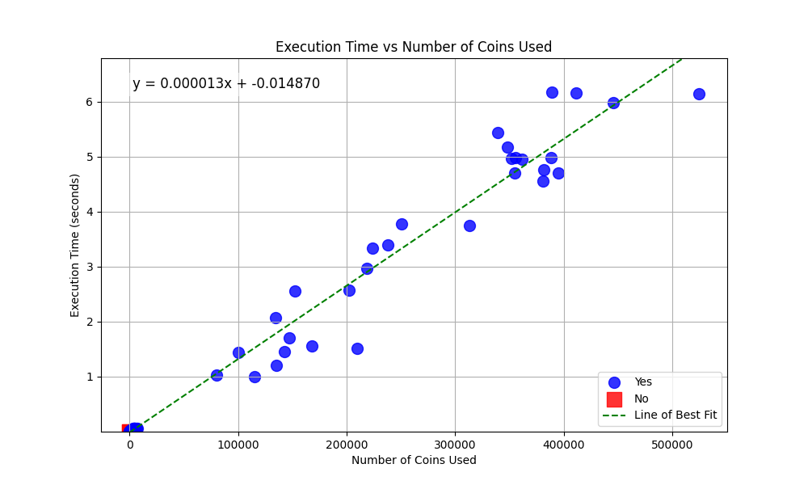

# Project 1 Readme Team Melvin

## 1. Team Name:
Melvin

## 2. Team Members Names and NetIDs:
Melvin Pineda Miguel - mpinedam

## 3. Overall Project Attempted, with Sub-Projects:
1. Knapsack

## 4. Overall Success of the Project:
I would say it went well; I solved the problem and was able to use my code on a lot of data sets. I would say everything that follows the functioning code was happening such as graphing the data and traversing a CSV.

## 5. Approximately Total Time (in hours) to Complete:
5 hours; the `knapsack_Melvin.py` script was by far the shortest part, which took only about an hour.

## 6. Link to GitHub Repository:
[KnapsackProject_Melvin](https://github.com/TAPMelvin/KnapsackProject_Melvin.git)

## 7. List of Included Files:

| File/Folder Name                     | File Contents and Use                                                         |
|--------------------------------------|------------------------------------------------------------------------------|
| **Code Files**                       |                                                                              |
| `knapsack_Melvin.py`                | Used to solve the knapsack problem and see how many coins were used         |
| `knapsackTestCaseGen.py`            | This was used to generate data to solve with `knapsack_Melvin.py`          |
| `solvedDataToCSV_Melvin.py`         | This was used to turn `generatedDataSolved_Melvin.txt` to CSV to graph more easily |
| `graph_Melvin.py`                   | Used to graph CSV data to `plot_Melvin.png`                                 |
| **Test Files**                       |                                                                              |
| `generatedData_Melvin.txt`          | This was data produced from `knapsackTestCaseGen.py` which was given in class |
| **Output Files**                     |                                                                              |
| `generatedDataSolved_Melvin.txt`    | Used this to store output from `knapsack_Melvin.py`                        |
| `timingData_Melvin.csv`             | This was created to turn `generatedDataSolved_Melvin.txt` to CSV to graph more easily |
| **Plots (as needed)**                |                                                                              |
| `plot_Melvin.png`                   | The plot itself                                                              |

## 8. Programming Languages Used, and Associated Libraries:
All done in Python; libraries used include `matplotlib`, `numpy`, `time`, and `csv`.

## 9. Key Data Structures (for Each Sub-Project):
For knapsack, it was mainly a dynamic programming array.

## 10. General Operation of Code (for Each Subproject):
1. Generate data from `knapsackTestCaseGen.py`.
2. Pass that data to `knapsack_Melvin.py` and save it.
3. Run `solvedDataToCSV_Melvin.py` to create a CSV.
4. Graph the CSV data, which also does the calculation for the best line of fit.

## 11. What Test Cases You Used/Added, Why You Used Them, What They Told You About the Correctness of Your Code:
I used the script that generated data to use; it was interesting. The first three times I ran it, every single coin amount was able to be made, so I manually added two not possible cases to check it was correct. I also manually checked some tricky ones.

## 12. How You Managed the Code Development:
I first started by solving the knapsack problem, then just followed the logic I would normally use to graph data on something like Excel, such as converting it to a better format (CSV), making the plot look good, and finally trying to get a best line of fit.

## 13. Detailed Discussion of Results:
The results from the knapsack problem showed the complexity of finding combinations to produce a target amount when using coins can vary depending on how big the target goal is. The graph had a linear increase, indicating that as the number of coins increases, the execution time also tends to rise, which makes sense given the computational difficulty of the problem. The computation time keeps increasing and never really gets bounded; we are solving this in linear time, but there is no way to make that time shorter as the coins get bigger.

## 14. How Team Was Organized:
NO TEAM

## 15. What You Might Do Differently If You Did the Project Again:
I would maybe explore other ways of doing this project. Off the bat, the most efficient way I knew of solving this was with dynamic programming, so that's what I did. It turned out to be pretty efficient, but this wasn’t guaranteed. Next time, I wouldn’t decide on an answer immediately and stick to it just in case it wasn’t the most efficient way.

## 16. Any Additional Material:
None
